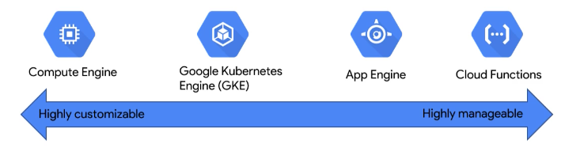
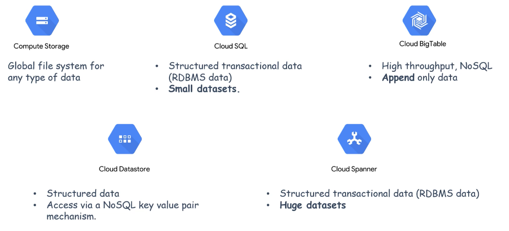

# Introduction to GCP

GCP includes the following services

- Compute services
  - **Compute Engine** is a Iaas (infrastructure as a service) solution
  - **App Engine** is a Pass (platform as a service) solution
  - **Google Kubernetes Engine** (GKE) is a Cass (containers as a service) solution
  - **Cloud Functions** is a Faas (functions as a service) solution

- Storage services
  - **Cloud Storage** is a unified object storage service to store any kind of data
  - **Cloud SQL** for relational DBs (MySQL, PostgreSQL, SQL Server) used for small datasets
  - **Cloud BigTable** is a NoSQL big data database service
  - **Cloud Datastore** is a NoSQL DB with ACID compliant transactions
  - **Cloud Spanner** for RDBMS data with large datasets 

- Big data services (stream and batch processing)
  - **BigQuery** data warehouse with SQL querying capabilities
  - **Cloud Dataflow** data processing service for batch and stream based on Apache Beam's programming model
  - **Cloud Dataproc** managed Apache Spark and Apache Hadoop service and other open source data pipeline services
  - **Cloud Pub/Sub** real-time messaging service for applications
  - **Cloud Datalab** data exploration, analysis, and viz
  - **Cloud Dataprep** for exploring, cleaning and preparing structured or unstructured data for analysis, reporting, or machine learning
  - **Cloud Composer** is used to author, schedule and monitor Apache Airflow pipelines and workflows
  - **Cloud Data Fusion** used for integration of ETL workflows

- AI and ML services
