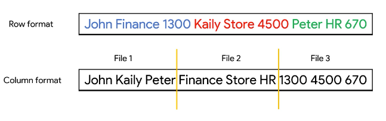
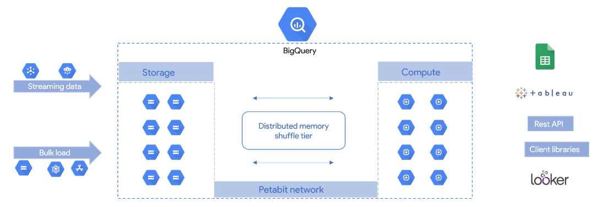

# BigQuery architecture

Engine: Google BigQuery uses the Dremel engine. This engine works with a combination of columnar data layouts and a tree architecture.

File system: Colossus. This uses compressed columnar storage. This columnar format is known as a *capacitor*. This capacitor allows Colossus to work with the compressed file itself.

Storage and compute are decoupled and can thus scale separately on demand. This means that data can be ingested while it's been queried without one process delaying the other.

