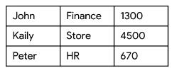

# BigQuery architecture

**Engine:** Google BigQuery uses the *Dremel* engine. This engine works with a combination of columnar data layouts and a tree architecture.

**File system:** Google BigQuery uses the *Colossus* file system. This uses compressed columnar storage. This columnar format is known as a *capacitor*. This capacitor allows Colossus to work with the compressed file itself.

The columnar format saves costs. Suppose the following table is stored

A traditional DB stores everything is rows, so even if the user only requests data from the first two columns, the entire table needs to be scanned. With columnar storage, only the files with the requested columns needs to be scanned.

Storage and compute are decoupled and can thus scale separately on demand. This means that data can be ingested while it's been queried without one process delaying the other.

