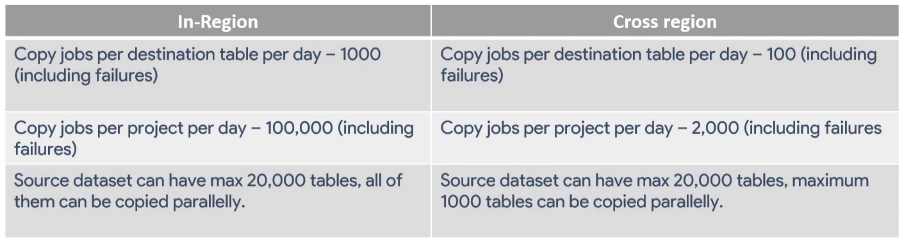

# Operations on datasets and tables

## Roles

Datasets level permissions determine the groups, users, and service accounts that can access the tables and views in a dataset. BiQuery also provides access control at the column level, but not at the table level. To explore permissions, select the data set and go to *SHARE DATASET*. On the side menu you can see the list of accounts with access, grouped by their roles. A complete definition of each rol can be found [here](https://cloud.google.com/bigquery/docs/access-control-basic-roles).

If the BiqQuery Data Transfer API has been enabled, you can also copy the dataset. When copying, you can change the name, location, and default expiration of the tables in it. Since the Data Transfer API is not available in all regions yet, only data sets in certain regions can be copied. The complete list can be found [here](https://cloud.google.com/bigquery-transfer/docs/locations).

To automate this process we can go to *Transfers* -> *Create transfer*. Select the source, provide a name for the transfer, schedule it, select the dataset ID for source and destination. You can enable emails for transfer fails.

There are some quota limits for transfer jobs that depend on whether they are in region or cross region jobs:

Also, keep in mind that

- only 1 active copy can be active at a time (other copy jobs of the same table are queued)
- copying views, external tables, and streaming buffers is not supported
- encrypted tables can only be copied within the same region if the encryption is customer managed

## Modifying schemas

Schema changes in BigQuery are classified into two types: native or manual. BigQuery only supports two types of native modifications: 

1. adding new columns (only `NULLABLE` or `REPEATED` columns can be added)
2. relaxing from `REQUIRED` to `NULLABLE` (this can not be undone, and can only be done through CLI)

All other schema changes are not natively supported in BigQuery and will require manual workarounds.
