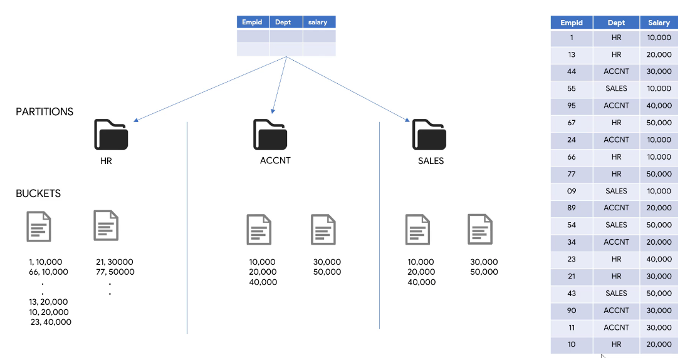

# Clustering tables

Clustering is used to organize rows based on the content of one or more columns. Clustering can be used with partitioned tables. The partition and the clustering can be done based on the same column.



When clustering by a column not all rows in that bucket need to have the same value (rather, they need to fall within that buckets range), but every row will belong to one and only one cluster.

Just as with partitioning, the ultimate goal is that when data is consumed, only the necessary clusters (and partitions) will be scanned/computed. So clustering improves the performance of filtering and aggregating queries (both in terms of time and cost).

When we partition, each partition is a directory. When we use clustering, each cluster is a file, under the directory of its partition. Which rows are saved in each cluster is determined by a hashing algorithm.

## When to choose what

Use **partitioning only** alone when you need strict cost guarantees before running queries, or when you need partition-level management (for example, partition expiration).

Use **partitioning and clustering** when data size requires it and there is no need for strict cost guarantees. Also, if the main operations on a table will be filtering and aggregation.

Use **clustering only** when data is unique or its partition size is below 1Gb.

## Creating clustered tables

Clustered tables are created just like any other table. Just needs to select the clustering column(s). If multiple columns are used they need to be comma-separated. At maximum, four columns can be used, and the order in which they are selected is important. This is because when loading data into the table, BigQuery will sort the data by its clustering columns, in the order in which they were supplied.

When querying the data in a clustered table, the `WHERE` clause conditions should be supplied in the same order as the clustering was done.

Do not use the cluster columns for complex filtering conditions, like the following:

``` sql
SELECT *
FROM `bigquery-public-data.geo_openstreetmap.planet_layers`
WHERE CAST(layer_code AS STRING) = "1101"
```

Do not compare one table cluster columns to other table columns.

## Limits

Partitioned and clustered tables are subject to the limits of partitioned tables. Additionally:

- only standard SQL is supported for querying and writing
- cluster specification modifications will only apply to new data
- only top-level columns can be used for clustering
- repeated columns can not be used for clustering
- allowed data types for clustering columns are: `DATE`, `BOOLEAN`, `GEOGRAPHY`, `INT64`, `NUMERIC`, `STRING`, `TIMESTAMP`
