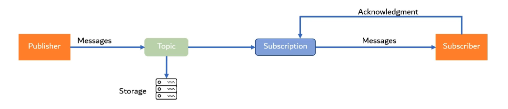

# Build streaming data pipelines

Streaming data is data generated in real time by various resources at a high speed rate. This data pipeline will ingest and process the data as soon as it's generated. Beam uses the same API for batch or stream process. The GCP service that allows us to ingest streaming data is **Google Pub/Sub**. This service provides a **Pub**lisher/**Sub**scriber architecture.

Each data point that arrives at Pub/Sub is called a **Message**. All non-mandatory information that describes the message is called an **Attribute** of the message.

The **Publisher** is responsible for generating the messages. These messages are published to a **Topic** (think of it as a folder). The topic is a persistance storage system from where the messages can be read as a queue. Their can be multiple publishers publishing messages to the same topic.

The **Subscriber** will consume (read) those messages by creating a **Subscription** to that topic. A subscription details the kind of messages that the subscriber is interested in. There can be many subscribers with multiple subscriptions reading data from a Topic.

In Google Pub/Sub messages will be stored until the Subscriber acknowledges that it has been consumed and stored, or a maximum of 7 days. If there are not Subscribers to receive the message, it will be discarded.

## Subscribing to a Topic

Go to Pub/Sub. Select the Topic from the list of available resources. You can view the messages by clicking on *View messages*. Then click on *Create subscription*. This requires a subscription ID (name). The delivery type can be **Pull** or **Push**. Pull is for voluntarily pull the messages, whereas push is for reading the messages as they arrive. You can set up a maximum message retention of 7 days, and even make acknowledged messages to be retain until the end of such period. Once you've selected all your options, click the *CREATE* button.

When visiting the Subscription, you can now click on the *PULL* button to see the messages that have been received.

## Ingesting data

Beam has a unified API for batch and stream processing, so *p-collections* will still be *p-collections*. We do need to change the source transform to be of `ReadFromPubSub` class. Also, because we are dealing with streaming data here, no aggregations can be performed using windows.

Once your pipeline is finished, upload it and run it in the cloud command line, but this time passing the pubsub topic as the `--input` argument.
