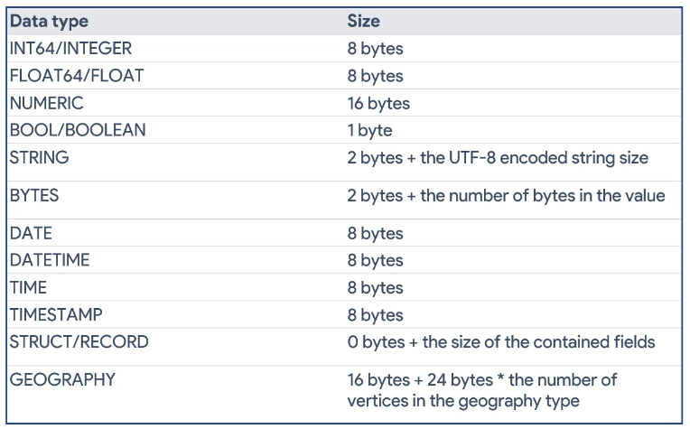

# BigQuery pricing

Pricing can be found [here](https://cloud.google.com/bigquery/pricing#active_storage).

## Storage

Data stored in GCP is classified in two categories:

1. **Active data** is any table or partition that has been modified in the past 90 days
2. **Long-term data** is any table or partition that has not been modified in the past 90 days

## Querying

There are two pricing models to choose from:

1. **On-demand pricing** charges only when the query is run and is based on the number of bytes queried
2. **Flat-rate pricing** pays upfront to get a desired number of dedicated resources for time period (seconds, month, year)

## API, DML

Streaming ingestion and DML operations have a small cost. You are charged only for rows that are successfully inserted.

DML statements are charged based on the bytes processed. This is why using partitions and only including the needed columns in `SELECT` statements is so important. Below is the number of bytes per column data-type.

